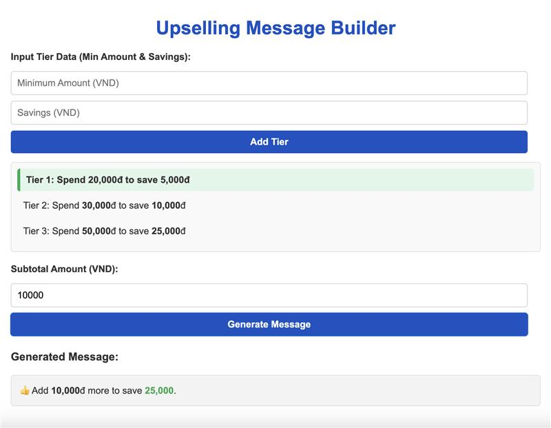

# 🚀 Upselling Message Builder

## 🌟 Overview  
The **Upselling Message Builder** helps businesses create personalized upselling messages to encourage customers to maximize their savings. Define savings tiers, input a subtotal, and instantly generate tailored messages with clear visual highlights.

## ✨ Features  
- **📊 Add Tier Data**: Input minimum amounts and savings values.  
- **🔄 Dynamic Message Generation**: Create personalized messages based on customer subtotals.  
- **🎯 Tier Highlighting**: Visually emphasize relevant tiers.  
- **⚡ Automatic Sorting & Merging**: Maintain a clean and organized tier list.  
- **📱 Responsive Design**: Works seamlessly on desktop and mobile devices.  

## 🛠️ How to Use  
1. **➕ Add Tier Data**:  
   - Enter a minimum spending amount and savings in the "Input Tier Data" section.  
   - Click **"Add Tier"** to save. Duplicate entries are merged automatically.  
2. **💵 Enter Subtotal**:  
   - Input the customer's subtotal in the "Subtotal Amount" field.  
   - Click **"Generate Message"** to see the upselling message.  
3. **👀 View Results**:  
   - The message and relevant tiers are highlighted for easy interpretation.  

## 💬 Feedback and Support  
For feedback or assistance, contact **Cuong Nguyen**:  
- **📧 Email**: [cuongndc9@gmail.com](mailto:cuongndc9@gmail.com)  
- **🔗 LinkedIn**: [Cuong Nguyen](https://www.linkedin.com/in/cuong9)  

🎉 Enjoy using the **Upselling Message Builder** to boost your sales!  
